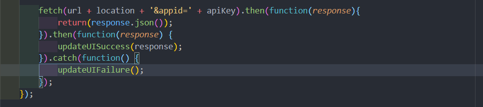

# App-Building---Vanilla-JS-1

Course on using vanilla JavaScript to re-write code from libraries such as jQuery and frameworks like React to improve site speed and functionality without impacting user experience.
 

## Goal

Refactor the jQuery code from .get, .done and .fail to fetch, then and catch

## Starting Code

## Final Code

## Website: Weather Functionality

In the upper right hand corner a user can type in a location to view the local weather using the [Open Weather Map API](https://openweathermap.org/api).
